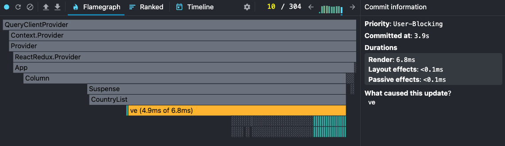
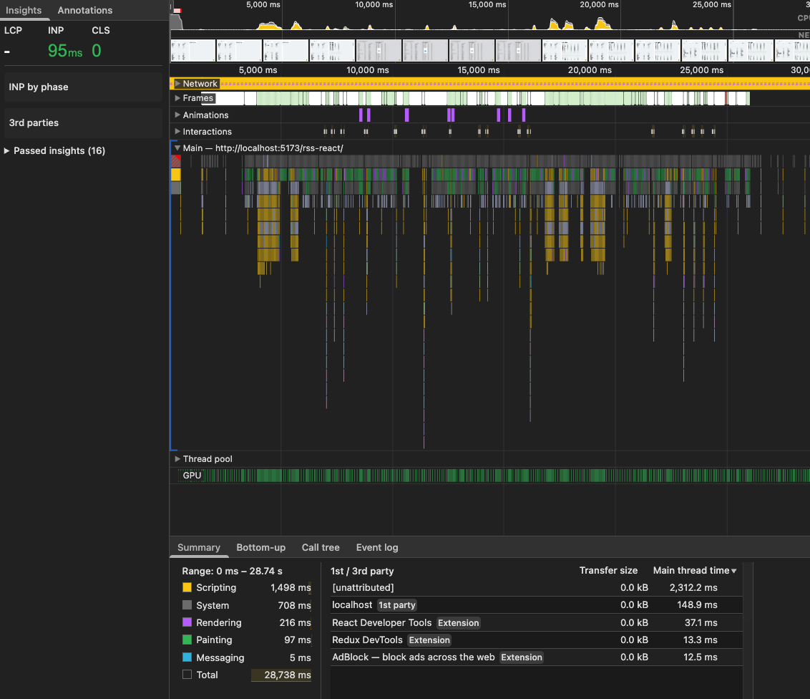

Hi!
react-window 2.0 (and below i believe) uses React.memo under the hood, so we dont need to use it explicitly in list/grid components. So i dont know how to measure "before and after" optimization

I wish i knew what kind of data i must provide for you to check. So there is bunch of almost random screenshots

Overall it's kinda fast cause i use cached data. (we're fetching it only one time)
if you want to change this behavior, go to main.tsx

```
const queryClient = new QueryClient({
defaultOptions: {
queries: {
staleTime: 1000 * 60 * 60 * 24,
},
},
});
```

change staleTime to something you're comfort with or remove it




